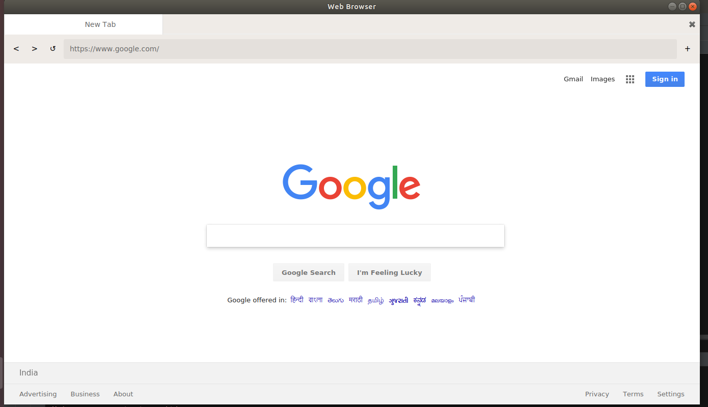

** WEB BROWSER ** 

Language: Python3

Frameworks: PyQt5 (a wrapper around QT Framework in python)

A web browser made with the help of PyQt5.

In this i use a webview from QtWebKitWidgets to load the web View in my GUI Applications

Multiple tabs are given so that one can browse different sites at a time.

You can delete move or add the tabs.

You can go forward Backward or refresh the certain page.

Some images of the view are

